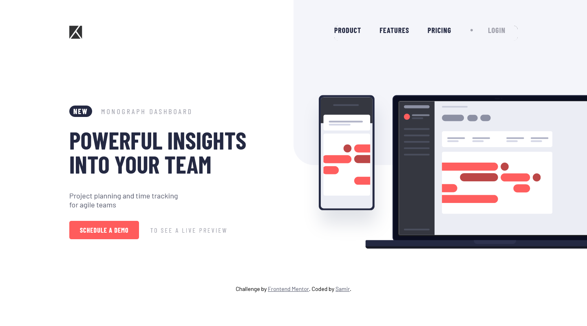
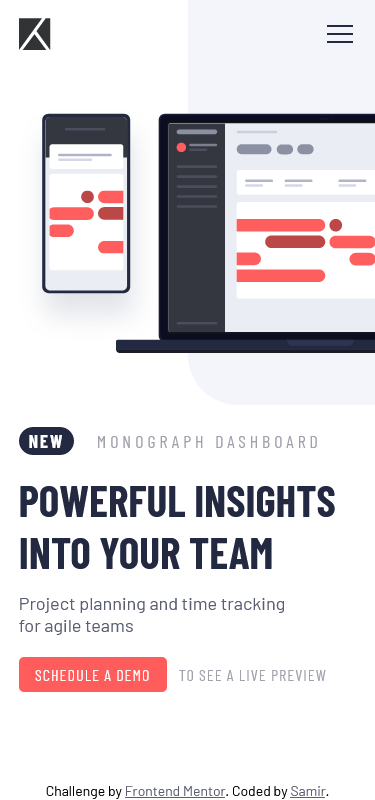

# Frontend Mentor - Project tracking intro component solution

This is a solution to the [Project tracking intro component challenge on Frontend Mentor](https://www.frontendmentor.io/challenges/project-tracking-intro-component-5d289097500fcb331a67d80e). Frontend Mentor challenges help you improve your coding skills by building realistic projects.

## Table of contents

- [Overview](#overview)
  - [Screenshot](#screenshot)
  - [Links](#links)
- [My process](#my-process)
  - [Built with](#built-with)
  - [What I learned](#what-i-learned)
  - [Useful resources](#useful-resources)
- [Author](#author)

## Overview

### Screenshot




### Links

- [Solution URL](https://github.com/samirhembrom/Frontend-Mentor---Project-tracking-intro-component-solution)
- [Live Site URL](https://frontend-mentor-project-tracking-intro-component-solution.vercel.app/)

## My process

### Built with

- Semantic HTML5 markup
- CSS custom properties
- Flexbox
- CSS Grid
- Mobile-first workflow

### What I learned

I find it quite intriguing when different types of animation seems so visually appealing. I learned few ways to give animation and trying to understand more about different animation techniques.

```css
@keyframes scalling {
  0% {
    transform: scale(0, 0.025);
  }
  50% {
    transform: scale(1, 0.025);
  }
  100% {
    opacity: 1;
  }
}
```

### Useful resources

- [Animation](https://www.youtube.com/watch?v=zAbnlisUFZE&t=1s) - This helped me for aniamting. I really liked how the video explained so nicely about animation.

## Author

- Frontend Mentor - [@samirhembrom007](https://www.frontendmentor.io/profile/samirhembrom007)
- Twitter - [@SamirHembrom11](https://twitter.com/SamirHembrom11)
